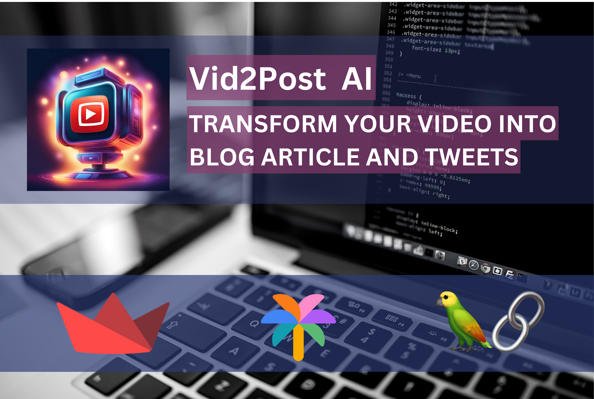

<div align="center">
  
</div>

Vid2Post AI is an AI Streamlit app, leverages the latest advancements in AI technology, including Google LLMs (Palm / Gemini), to revolutionize the way you convert your videos into blog articles and tweets. With Vid2Post AI, you can effortlessly download your videos from YouTube or upload them from your device, and watch as they're transformed into ready-to-publish social media content.

Key Features:
1. Convert your videos into engaging blog articles and tweets with ease.
2. Harness the cutting-edge capabilities of the Gemini-pro for content generation.
4. Easily save your generated content as PDF reports for convenient reference and sharing.

Benefits:
1. Save time and effort by automating the content creation process with AI technology.
2. Boost your visibility and engagement with high-quality, ready-to-publish content.
3. Simplify your content creation workflow and maximize productivity.

Ideal For: Digital Marketers, Social Media Managers, Content Creators, Students and Businesses

Demo:
```
https://vid2post-jtjxnqndqt6qtwruyauzvo.streamlit.app
```
